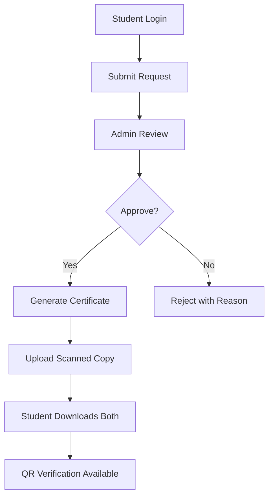

# 🎓 GAT Certificate Management System

[](https://web.dev/pwa-checklist/)
[](https://developers.google.com/web/fundamentals/design-and-ux/responsive)
[](https://developers.google.com/web/fundamentals/instant-and-offline/offline-cookbook)
[](LICENSE)

> **A revolutionary Progressive Web App for streamlined student certificate management**
 By  - Meghana HJ,
     - Dhyan Kumar M

Transform your department's certificate workflow from manual, desk-visit chaos to a single, beautiful, trackable digital channel. Built with modern web technologies and stunning glassmorphism UI.

## 🌟 **Live Demo**
**Experience it now:** [GAT Certificate System](https://gat-cms.netlify.app/)

## ✨ **Key Features**

### 🎯 **For Students**
- **📝 Request Certificates** - Bonafide, internship letters, transcripts
- **📱 Real-time Tracking** - Live status updates with tracking IDs  
- **📄 Dual Downloads** - Both generated PDFs and scanned copies
- **🔍 QR Verification** - Instant certificate authenticity checking
- **📊 Request History** - Complete application timeline

### 👨‍💼 **For Administrators**  
- **⚡ Quick Approvals** - Streamlined review and approval workflow
- **📋 Certificate Generation** - Auto-generate with digital signatures & QR codes
- **📤 Upload Scanned Copies** - Drag-and-drop physical certificate uploads
- **📈 Analytics Dashboard** - System insights and statistics
- **🔍 Audit Logs** - Complete activity tracking for accountability

### 🚀 **Progressive Web App**
- **📱 Installable** - Add to home screen on any device
- **⚡ Offline Support** - Works without internet connection
- **🎨 Beautiful UI** - Modern dark theme with glassmorphism effects
- **📱 Responsive** - Perfect on mobile, tablet, and desktop

## 🖼️ **Screenshots**


*Beautiful dark-themed dashboard with glassmorphism effects*

## 🚀 **Quick Start**

```bash
# Clone the repository
git clone https://github.com/yourusername/gat-certificate-management.git

# Navigate to project directory
cd gat-certificate-management

# Open in browser
open index.html
```

**That's it!** No server setup, no database configuration. Just open and use.

## 🔐 **Demo Credentials**

### Students
| Email | Password | Student ID |
|-------|----------|------------|
| `rajesh.kumar@gat.ac.in` | `student123` | 4NM20CS001 |
| `priya.sharma@gat.ac.in` | `student123` | 4NM20CS025 |

### Administrators  
| Email | Password | Role |
|-------|----------|------|
| `suresh.reddy@gat.ac.in` | `admin123` | HOD |
| `anitha.rao@gat.ac.in` | `admin123` | Academic Officer |

## 🛠️ **Tech Stack**

- **Frontend**: HTML5, CSS3 (Flexbox, Grid), Vanilla JavaScript ES6+
- **UI/UX**: Glassmorphism, Dark Theme, Purple/Blue Gradients
- **PWA**: Service Worker, Web App Manifest, Offline Caching
- **Libraries**: 
  - [QRCode.js](https://github.com/davidshimjs/qrcodejs) - QR code generation
  - [jsPDF](https://github.com/parallax/jsPDF) - Client-side PDF creation
- **Storage**: localStorage (Client-side persistence)

## 🏗️ **Architecture**

```
GAT Certificate System
├── 🎨 Presentation Layer (HTML/CSS/JS)
├── 🧠 Business Logic (CertificateApp Class)  
├── 💾 Data Layer (localStorage)
├── 🔧 Service Worker (Offline Support)
└── 📱 PWA Manifest (Installation)
```

### **Core Algorithms**
- **Template Engine**: Dynamic certificate generation with placeholder replacement
- **QR Code System**: Unique verification codes with authenticity checking
- **Role-Based Rendering**: Conditional UI based on user permissions
- **File Processing**: Base64 encoding for client-side file storage
- **Audit Trail**: Systematic action logging with timestamps

## 📋 **Complete Workflow**



## 🎯 **Why This Solution?**

### **Advantages Over Traditional Systems**
- ✅ **Zero Infrastructure** - No server or database setup required
- ✅ **Instant Deployment** - Works immediately on any web server
- ✅ **Mobile-First** - Designed for smartphone usage
- ✅ **Secure by Design** - QR codes and digital signatures prevent forgery
- ✅ **Complete Audit Trail** - Every action logged and trackable
- ✅ **Offline Capability** - Works without internet connection

### **vs. Existing Solutions**
| Feature | Traditional | **GAT CMS** |
|---------|-------------|-------------|
| Setup Time | Days/Weeks | **Minutes** |
| Infrastructure | Server + DB | **None Required** |
| Mobile Support | Limited | **Native-like PWA** |
| Offline Access | None | **Full Support** |
| Security | Basic | **QR + Digital Signatures** |
| User Experience | Poor | **Modern & Intuitive** |

## 📱 **PWA Installation**

### On Mobile
1. Open the app URL in your browser
2. Tap "Add to Home Screen" 
3. Use like any native app

### On Desktop  
1. Open in Chrome/Edge
2. Click install icon in address bar
3. Access from desktop/start menu

## 🔮 **Future Roadmap**

### **Phase 2: Backend Integration**
- [ ] Firebase/Supabase backend for multi-device sync
- [ ] Real-time notifications and updates
- [ ] Cloud file storage for certificates
- [ ] Advanced analytics and reporting

### **Phase 3: Advanced Features**
- [ ] Blockchain certificate verification
- [ ] AI-powered document validation
- [ ] Multiple language support
- [ ] Advanced role management

## 🤝 **Contributing**

We welcome contributions! Here's how:

1. **Fork** the repository
2. **Create** a feature branch (`git checkout -b feature/AmazingFeature`)
3. **Commit** changes (`git commit -m 'Add AmazingFeature'`)  
4. **Push** to branch (`git push origin feature/AmazingFeature`)
5. **Open** a Pull Request

## 📄 **License**

Distributed under the MIT License. See `LICENSE` for more information.

## 🙏 **Acknowledgments**

- Built for Global Academy of Technology (GAT)
- Inspired by the need for paperless, efficient certificate management
- Special thanks to the open-source community for amazing libraries

## 📞 **Support**

- **Issues**: [GitHub Issues](https://github.com/yourusername/gat-certificate-management/issues)
- **Discussions**: [GitHub Discussions](https://github.com/yourusername/gat-certificate-management/discussions)

---

<div align="center">

**⭐ Star this repo if it helped you!**

Made with ❤️ for educational institutions worldwide

[Report Bug](https://github.com/yourusername/gat-certificate-management/issues) • [Request Feature](https://github.com/yourusername/gat-certificate-management/issues) • [View Demo](https://ppl-ai-code-interpreter-files.s3.amazonaws.com/web/direct-files/03a7ab2512122ada4f229d3dd6d236e5/4c94a8ce-5168-40d2-81e4-c84243b26a32/index.html)

</div>
